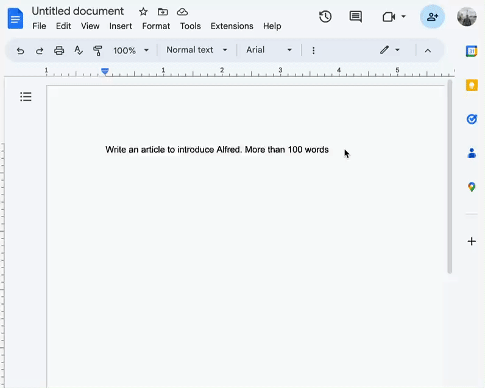
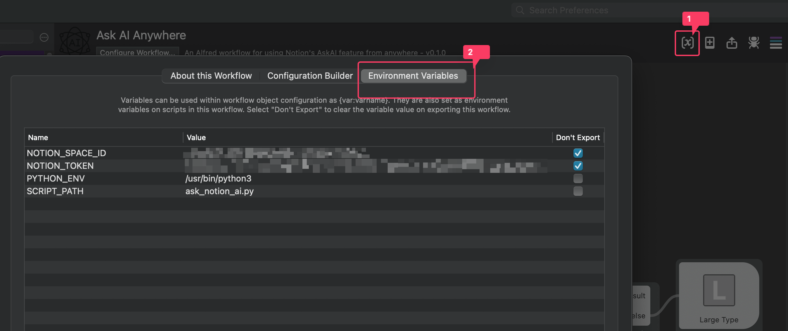
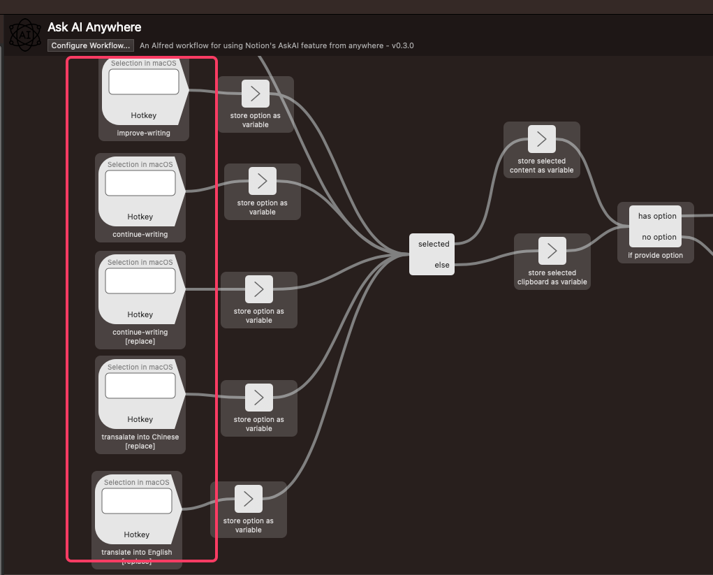

# AskAI Anywhere - Alfred Workflow

A powerful workflow for using Notion's AskAI feature from anywhere.



## Installation

1. [Download the workflow](https://github.com/kk17/alfred-ask-ai-anywhere-workflow/releases/latest)
2. Double click the `.alfredworkflow` file to install

Note that the [Alfred 5 Powerpack](https://www.alfredapp.com/powerpack/) and [NotionAI](https://www.notion.so/product/ai) are required to use the workflow.

## Workflow setup
After install the workflow, you need to do some setup.

1. Copy the command and run in termial to download the requirments.txt file from github and use pip3 to install the packages for system python3 environment
    ```bash
    curl https://raw.githubusercontent.com/kk17/alfred-ask-ai-anywhere-workflow/main/requirements.txt | xargs -n 1 /usr/bin/pip3 install
    ```
2. Follow [this guide](https://github.com/Vaayne/notionai-py#get-notion-token-and-workspace-id) to get Notion token and workspace ID from you broswer.
Open Alfred Preferences, go to Workflows and locate the workflow. Click the Variables icon on the top right and config the variables.

3. Config hotkeys for triggering the workflow.

The first hotkey is used to trgger a list filter that can list all the avariable options.
The rest hotkeys are shortcut for some of the options.

## Usage
To use, select any text anywhere then press the hotkeys you configured to trigger this workflow. 
You can also add more option in to the List Filter.

`ask_notion_ai.py` script usage:
```
/usr/bin/python3 ./ask_notion_ai.py --help

Usage: ask_notion_ai.py [OPTIONS] COMMAND [ARGS]...

  Command line interface for Notion AI API.

Options:
  --input-to-clipboard         Copy input content to clipboard.
  --combine-input-into-result  Combine input content into result.
  --result-to-keyboard         Output result to keyboard instead of stdout.
  --result-to-clipboard        Copy result to clipboard.
  --paste-result               Paste result from clipboard.
  -v, --verbose                Enable verbose output.
  --help                       Show this message and exit.

Commands:
  change-tone
  continue-writing
  improve-writing
  summarize
  translate
```

## Advanced Features
If no text is selected, this workflow will use the contents of your clipboard as input. 

You can create your own prompt using the `continue-writing` command, followed by a `#` symbol. For example, an option in the list script could be:

```
continue-writing #translate the following content into Singlish:
```

Additionally, some Text to Speech options have been added. If they are not working, you may need to download the necessary voice in your OS system preferences under Spoken Content -> System Voice -> Manage Voices.

## Troubleshooting
- [Using the Workflow Debugger - Alfred Help and Support](https://www.alfredapp.com/help/workflows/advanced/debugger/)


## Contributing

See [this README](CONTRIBUTING.md)


## Donating

Like this workflow? Consider donating! 😻

<a href="https://www.buymeacoffee.com/kk17" target="_blank"></a>


## Credits

- The Alfred workflow is using [notionai_py](https://github.com/Vaayne/notionai-py) python package.
- Icon from https://www.flaticon.com/